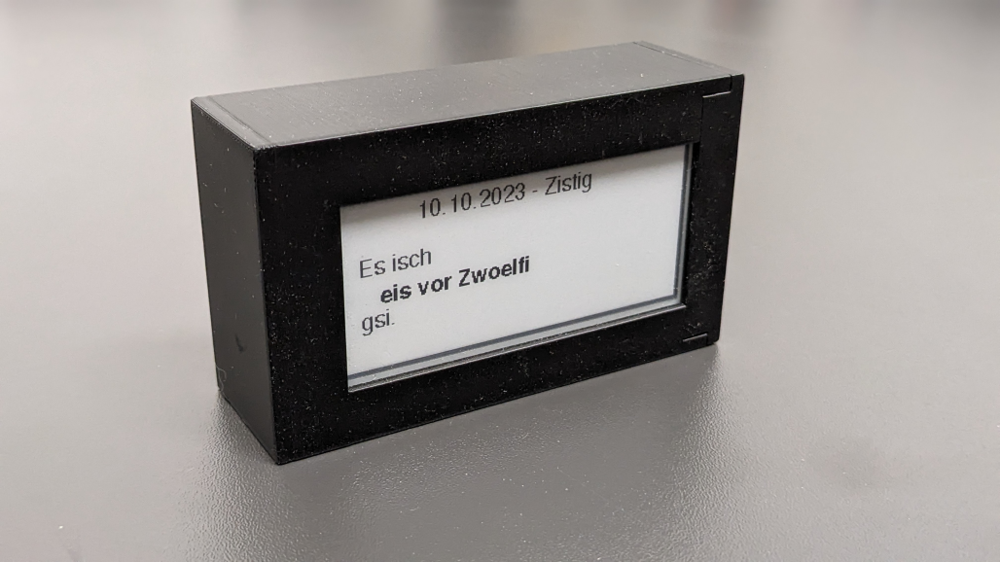
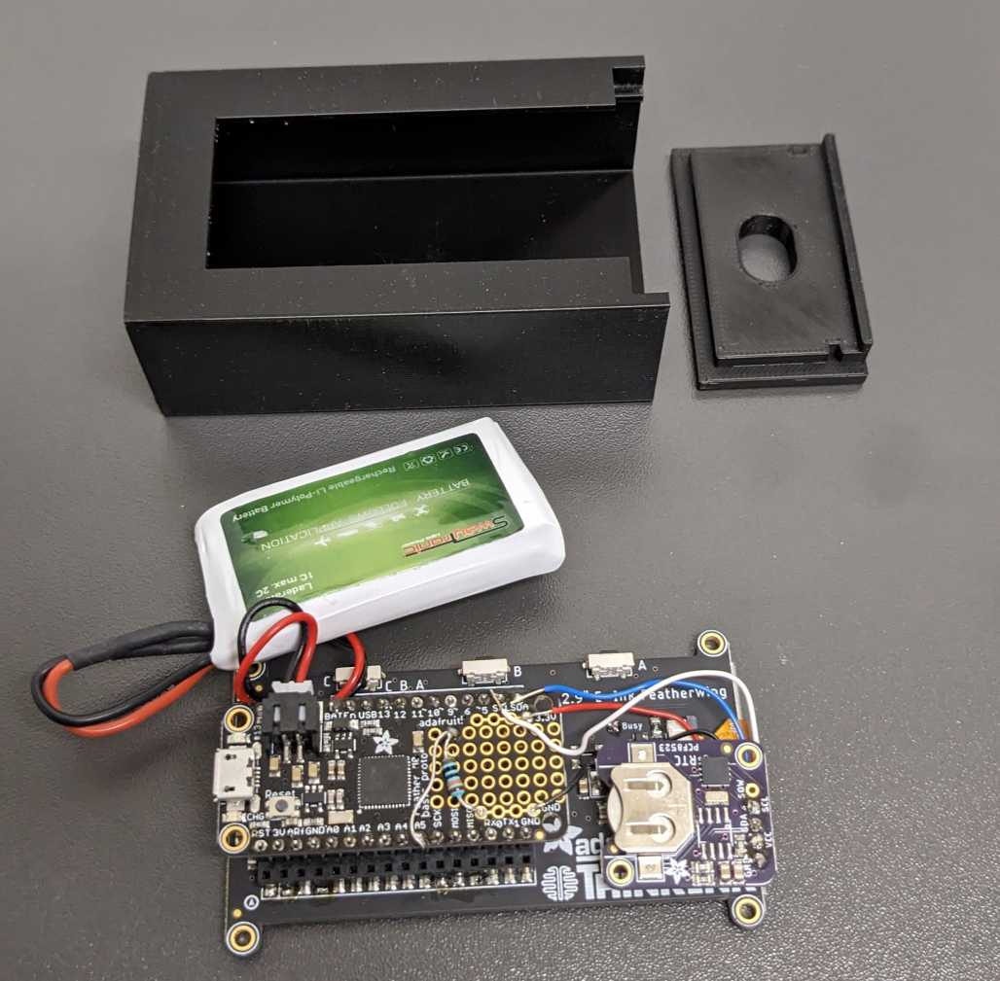

# Swissgerman sentence clock
Clock to display the current time in a swissgerman sentence on a eInk display.
One battery charge of 1100 mAh lasts for about 5 days when the screen is refreshed every 1 minute.
Use 3D_print/Lid_with_hole.stl to have a USB wire run into the clock.

# Used parts

- [Adafruit Feather M0 Basic Proto](https://www.adafruit.com/product/2772)
- [Adafruit 2.9" Grayscale eInk](https://www.adafruit.com/product/4777)
- [Adafruit PCF8523 Real Time Clock](https://www.adafruit.com/product/3295)
- Battery (CR1220)
- LiPo Battery
- 3D printed enclosure (available in this repo or [here on Onshape](https://cad.onshape.com/documents/8f49303399ef22a7e39bc2af/w/fa5502a23fe9f76c9c39dbc8/e/11aa9429d28955ad08e092fa?renderMode=0&uiState=632acc33edc92c60b2c7bdb9))
- Wires

# Installation
- Install Arduino IDE
- [Add Feather M0 to your IDE](https://learn.adafruit.com/adafruit-feather-m0-basic-proto/setup)
- Install [RTClib](https://learn.adafruit.com/adafruit-pcf8523-real-time-clock/rtc-with-arduino) library by Adafruit
- Install adafruit EPD, adafruit ImageReader and adafruit GFX library (see [here](https://learn.adafruit.com/adafruit-2-9-eink-display-breakouts-and-featherwings/arduino-setup))
- Connect through USB, upload code

# Update time
- Determine COM-Port
- Open SerialMonitor
- Upload code (keep SerialMonitor open)

If ever the Feather becomes unresponsive see [here](https://learn.adafruit.com/adafruit-feather-m0-express-designed-for-circuit-python-circuitpython/feather-help)

# Possible improvements
- Could set the Feather to deep sleep to save battery life
- Could add buttons to set time

 

